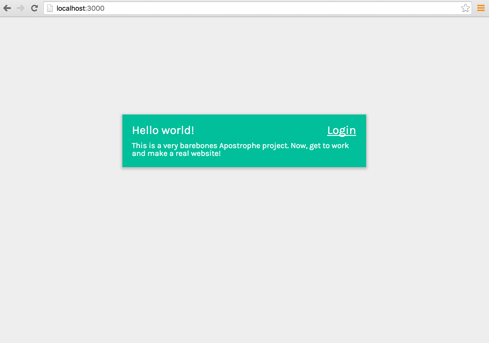
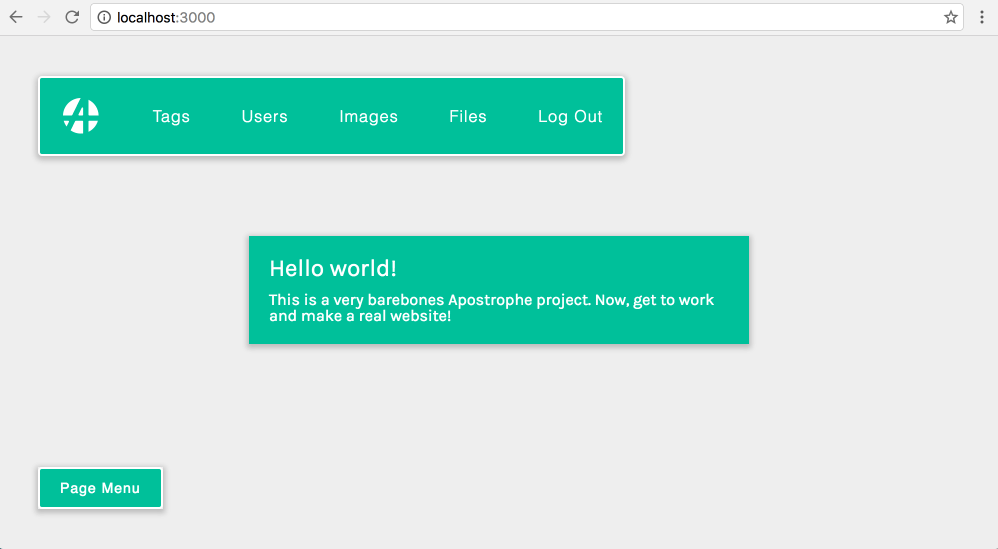
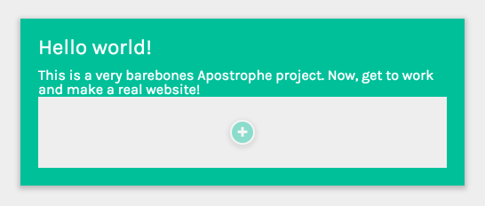
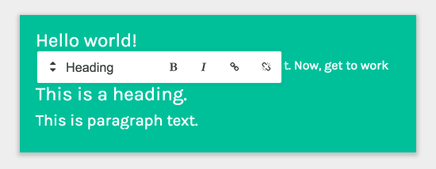
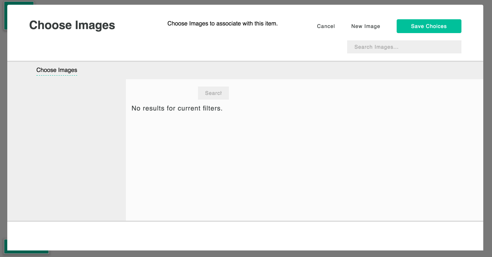
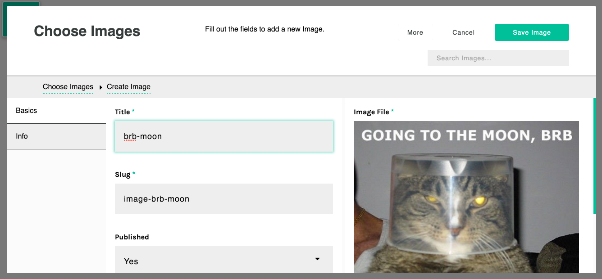
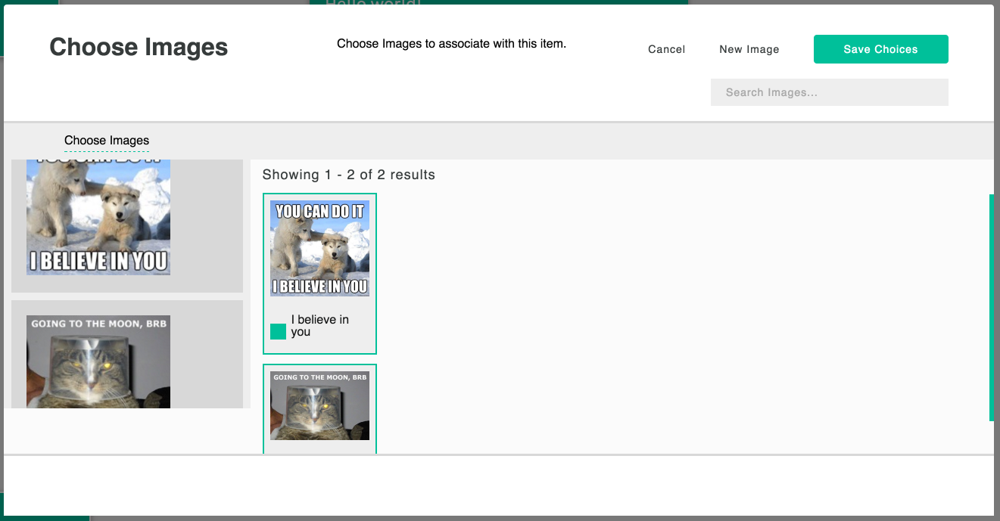
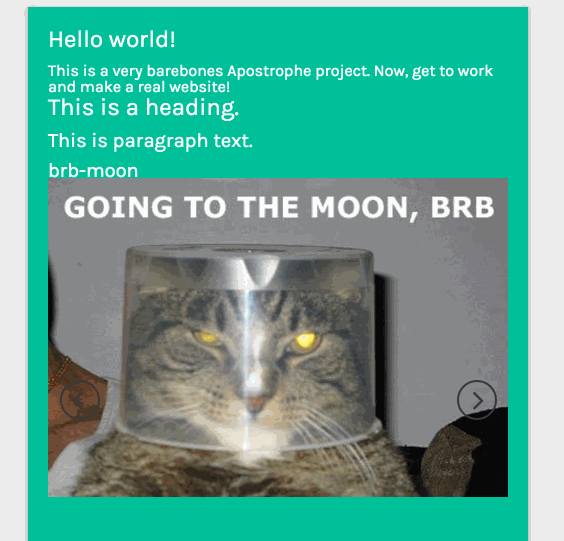

# Creating your first project

Now that you have all the dependencies for Apostrophe installed, you can create your first project!

## Generating a test project

Next, install the `apostrophe-cli` tool, which makes bootstrapping a new project a breeze, and create your project.

1. To install the `apostrophe-cli`, run the following command:

    ```bash
    # Install the apostrophe-cli module
    npm install apostrophe-cli -g
    ```

2. Now create a new project:

    ```bash
    # Create a project
    apostrophe create-project test-project
    ```
3. With the project created, you just need to jump in, install the dependencies, and start the server. You'll also be prompted to create a passowrd. Make sure you don't forget it --- you'll need it in a minute.

    ```bash
    # cd into the new project
    cd test-project
    # Install our dependencies (most notably, Apostrophe)
    npm install
    # Add an admin user to the admin group; prompts for password
    node app.js apostrophe-users:add admin admin
    # Go go go!
    node app.js
    ```

You have a test project up and running! Visit `http://localhost:3000` and view your site. You'll see a very simple home page... too simple! We'll fix that in a moment by adding more page types and some editable areas.




**Did you get a "Permission Denied" error?** On Linux, this would be because global npm packages must be installed as root in a typical setup. Use `sudo npm install` instead. On a Mac, this shouldn't happen if you installed node with Homebrew, because the `/usr/local` folder where Homebrew keeps its files should belong to your personal account. However, if you installed Homebrew with `sudo`, you'll need to be consistent and use `sudo` here too.


**Important: ** `test-project`** is the name for our example. For your project use your own project's "short name" containing only letters, digits, hyphens and/or underscores. It will be used by default as a MongoDB database name and a basis for cookie names, etc.** \(Hyphens seem more popular than underscores for such purposes.\) We'll continue to use `test-project` for the rest of this example. Alternatively, you can install a robust, themed, fully-baked project with this command:

```bash
apostrophe create-project --boilerplate https://github.com/apostrophecms/apostrophe-open-museum test-project
```

## Logging in

Next, you should sign on to the site:


1. In your browser, go to `http://localhost:3000/login`.

2. Log in with the credentials you just set up.
    * Username: `admin`
    * Password: `I told you not to forget it, didn't I?`

Once logged in, we are redirected to the home page once again, but with two additional elements present: an admin bar floating over the top left of the page and a page menu floating over the bottom left.



### Adding a content area

Now let's make it more interesting! Add an editable content area to the page.

1. Open `lib/modules/apostrophe-pages/views/pages/home.html` in your text editor.

2. Replace the existing contents with the following code to add an `apos.area` call:

```markup


Home

  <div class="main-content">
    <h3>Hello world!
      
        <a class="login-link" href="/login">Login</a>
      
    </h3>
    <p>This is a very barebones Apostrophe project. Now, get to work and make a real website!</p>
    {{ apos.area(data.page, 'body', {
      widgets: {
        'apostrophe-images': {
          size: 'full'
        },
        'apostrophe-rich-text': {
          toolbar: [ 'Styles', 'Bold', 'Italic', 'Link', 'Unlink' ],
          styles: [
            { name: 'Heading', element: 'h3' },
            { name: 'Subheading', element: 'h4' },
            { name: 'Paragraph', element: 'p' }
          ]
        }
      }
    }) }}
  </div>

```

Using the default configuration, you may be able to see the changes right away by refreshing the page, if not, you can restart your site manually or use `nodemon` to watch project files.

## Restarting your site

To restart your site,

1. Press "Control-C" in the terminal window where `node app.js` is running. \(You need to leave it running as long as your site is up. In production, there are other ways, which we'll cover later.\)
2. Run `node app.js` again \(tip: just press the up arrow, then enter\).
3. Refresh the browser.

### Use Nodemon to watch file changes

To avoid manual restarting in the future, you can use [Nodemon](https://nodemon.io) to watch project files.

1. Run `npm install -g nodemon` to install it globally.
2. Run `nodemon` from your project root folder to start your site with watching enabled.


When running `nodemon` from the project root, you don't need to provide any target or arguments. It will start `app.js` autmoatically by default. The configuration is found in `package.json` which was created when you installed the `apostrophe-cli` tools. You can adjust these settings to your needs.


Now, every time you change a file in your project, Nodemon will restart your application.

## Working with areas

Hey, what's this new button about?



Let's add some rich text and media to the page.

1.  Click the "+" sign and pick "rich text." You're presented with a friendly editor:
    

2.  Edit as you see fit and refresh your page. Notice that your changes have already been saved. _There is no save button because saving is automatic._

3.  To add a slideshow click _outside_ the rich text editor and you'll see two new "+" signs: one above the text and one below it.

4.  Click either one and pick "Image\(s\)", and you'll see the image library, which is initially empty:

    

5.  Click the "New Image" button at upper right and you'll see:

    

6.  Click "Upload File" to pick a GIF, JPEG or PNG file to upload from your computer.

7.  Fill out the title field, and click "Save Image."

8.  Click "New Image" again and upload a second file, fill out the title field, and save. 

9.  Next check the box next to each of them:

    

    \(As you check them off you'll see them appear at left in the "chosen items" area.\)

10. Now click "Save Choices" and boom: slideshow!



# "Whoa, this is cool! But... what did I just do?"

Great question! Now that we've had our "whoa" moment, let's break it all down. You'll work through another example, this time working through each step individually.

