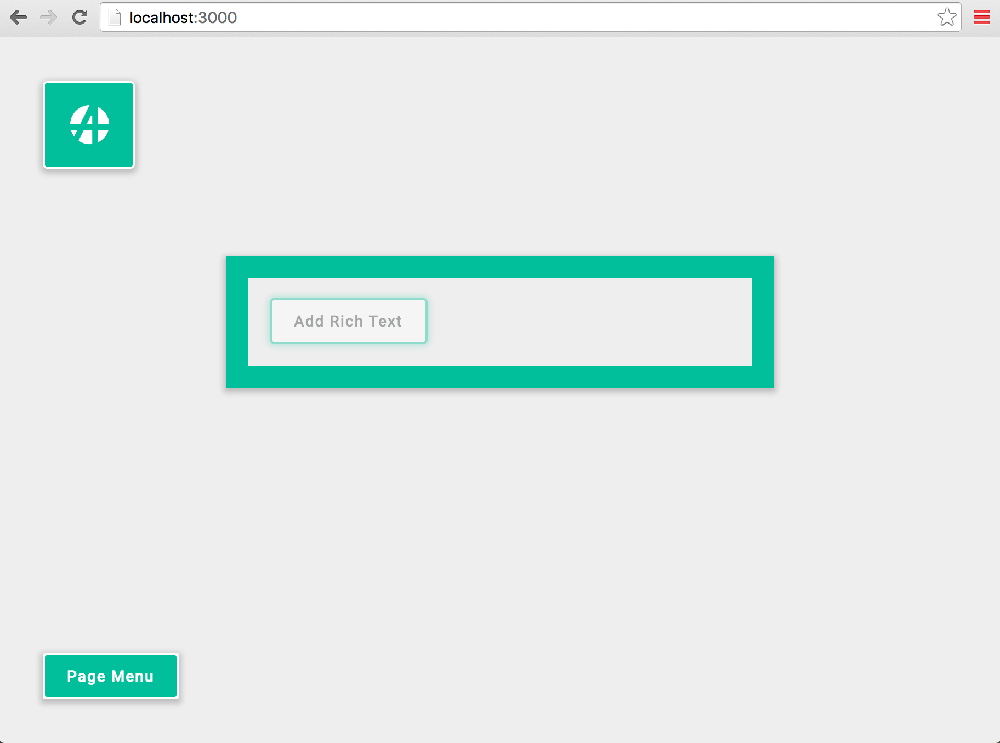

# Adding editable content to pages

Central to Apostrophe is the philosophy that editors can edit their content in context. In order for you to enable this functionality in your templates, Apostrophe provides `singleton` and `area` helpers that you can use in your templates.

## Singletons

Singletons are a slot on a page that allow an editor to add a single "widget" of a specific type. Let's add a rich text singleton to our `home.html` template! Open `home.html` and replace the `main` block that you created previously with this: 



```markup

  <div class="main-content">
    {{ apos.singleton(data.page, 'textBlock', 'apostrophe-rich-text', {
      toolbar: [ 'Bold', 'Italic' ]
    }) }}
  </div>

```



Let's deconstruct the arguments we are passing here.

#### `data.page`

The page object you want to save the singleton to. In this case, we are editing content on the current page, so the content should be saved to that page.

#### `'textBlock'`

The name of the area. This denotes what property the singleton will be saved to in the page object. In this case, it would be saved to `data.page['textBlock']`.

#### `'apostrophe-rich-text'`

The widget type we want to allow in the singleton. In this case, we are using the standard rich text widget.

#### `{ toolbar: [ 'Bold', 'Italic' ] }`

An "options" object that allows us to pass type-specific options to the widget. Rich text widgets support a `toolbar` option.

If we restart our server and refresh our site's home page while logged in, we'll see a gray block with a button prompting us to add rich text. Once you start adding text, your edits save automatically. **There is no "save" button because you don't need one.** All edits are saved in the background.



## Areas

Oftentimes, we'll want to enable an editor to add several widgets of different types to build out a column of content in a page. For this, we can use the `apos.area` helper.

When we use the area helper a "+" sign appears on the page, allowing the user to add a new widget in a series \(usually a vertical column\), often alternating between images and rich text. To see this in action, add this to `home.html`  below the text editor inside of the main `div`:



```markup
{{ apos.area(data.page, 'body', {
  widgets: {
    'apostrophe-rich-text': {
      toolbar: [ 'Bold', 'Italic' ]
    },
    'apostrophe-images': {
      size: 'full'
    }
  }
}) }}
```



The first two arguments for this helper work the same way as for `apos.singleton`. The third option is an options object. We can see that that options object supports a `widgets` option, which takes a key-value map of available widget names and their respective options.


Not sure how to add a second widget? After you're finished editing rich text, click anywhere outside of the rich text widget. Then hover over it and you'll see the "+" signs in each position where you're allowed to add a new widget.


## Widget Types

Apostrophe offers a range of widgets, and you can easily create your own. Here are some of the most popular widgets. Later on we'll also talk about "pieces" and how they allow you to create and reuse the same content around the site via pages and widgets.